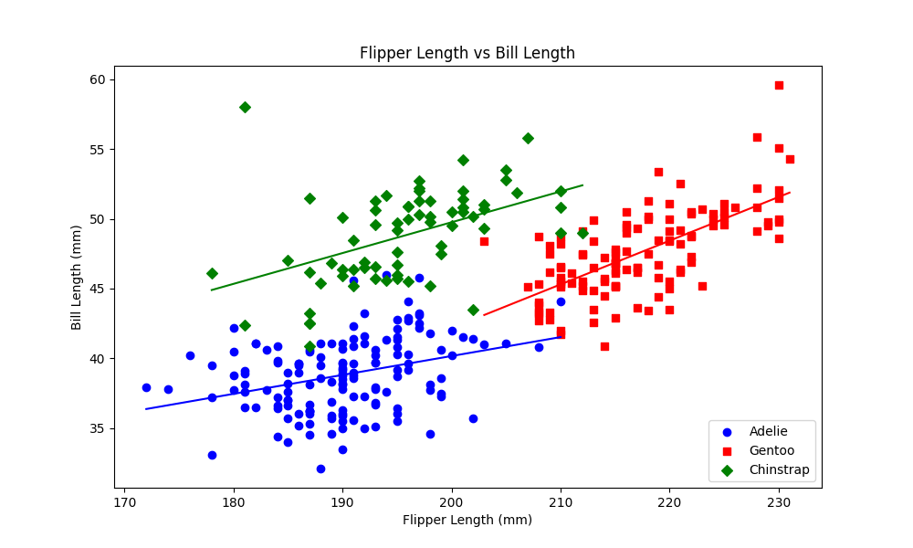
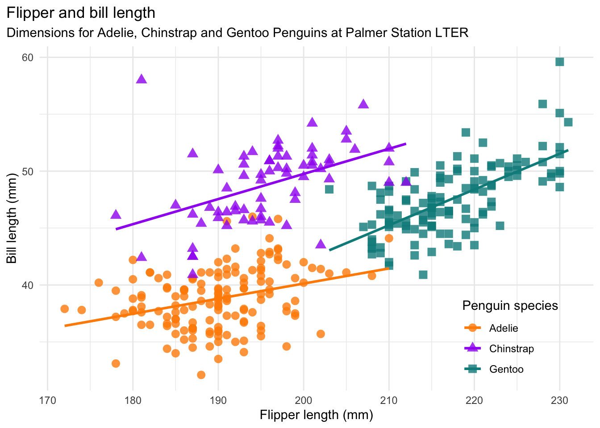
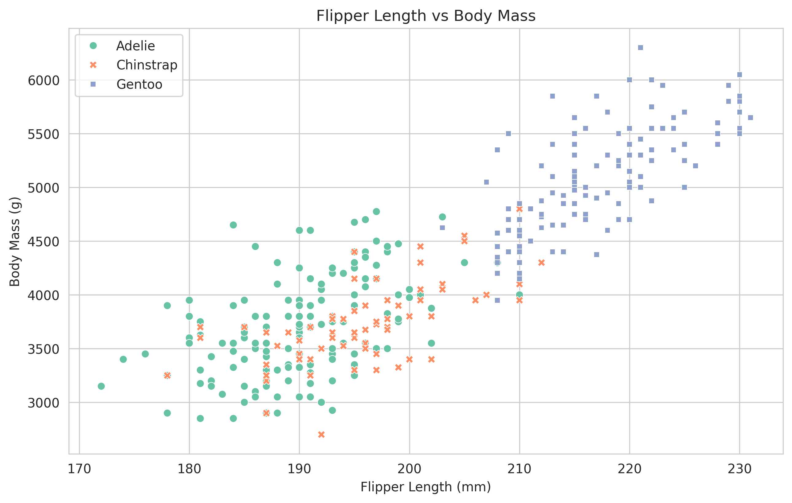
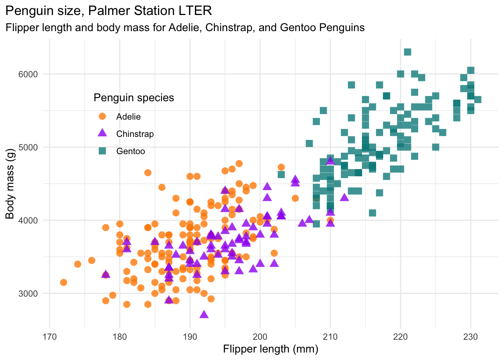
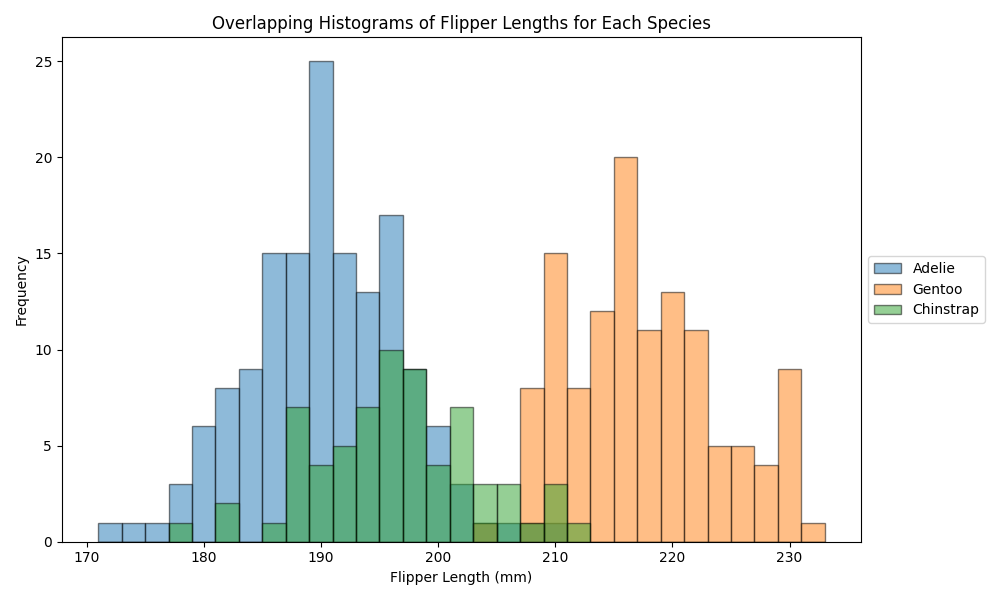
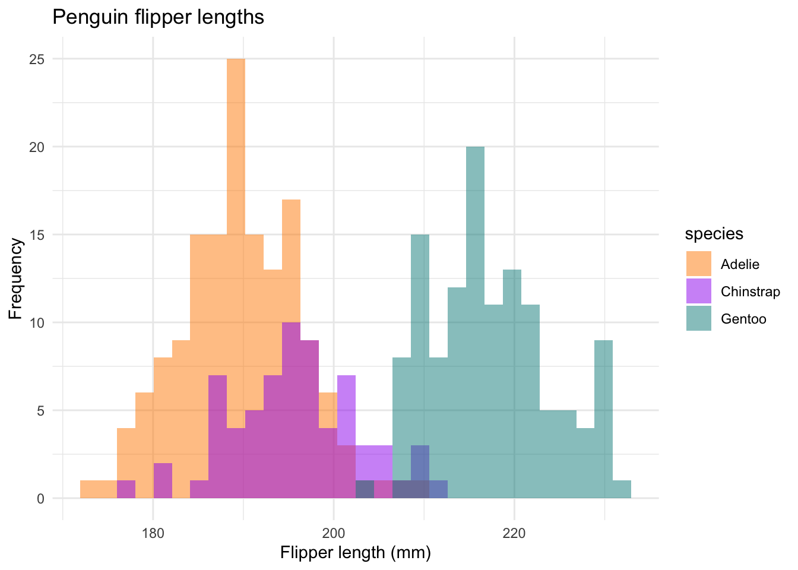

# Data Visualization Agent

# Description
A data visualization and transformation agent hosted on an accessible streamlit dashboard app. 

The AI agent can be ran locally or accessed [here](https://data-vis-agent.streamlit.app) with the agent hosted on the Streamlit Community Cloud. Users can input a description of a figure (e.g. a plot, chart, graph) or data transformation that they want to be produced from a dataset of their choosing or demo the agent by exploring the [Penuins dataset](https://github.com/allisonhorst/palmerpenguins) that is already imported. The agent generates and executes python code to construct the figure or the updated transformed dataset. 

The goal of building this data visualization agent and hosting it on a streamlit application was steps to develop a proof of concept prototype for devlopment into a production ready tool for users with little to no programming abilities to use. This serves as a functional tool or as a building block for the development of other agents for mutiple use cases. 

# Usage
## Streamlit Community Cloud 
The dataset agent is hosted on the Streamlit Community Cloud at the following link. 

https://data-vis-agent.streamlit.app

This allows anyone to have access to the agent to demo or to utilize for their data visualization or transformation needs. User dataset uploads are limited to 200MB. The uploaded datasets are not saved and will need to be reuploaded with each run instance of the app. 

## Local Implementation
The agent can also be installed locally and would allow for the agent to be used with larger datasets. Docker is a requirement for the app to run locally and will need to be installed.

Use the following commands to install additional requirement and to run the application.   
```

# Clone repo for current setup
git clone https://github.com/lpietan/Data-Vis-Agent-CL.git

cd Data-Vis-Agent-CL

# Install additional dependencies
pip install -r requirements.txt

# Run the application through a docker container
cd docker
docker compose up --build

# Note for subsequent runs of the app after the docker image has been built, the following command can be used to run the app
# docker compose up

```

Once the docker image of the app is up an running, the following can be inputted into a browser to use the app.

http://localhost:8501

The app should then display on the browser page. 

## Streamlit Application
Once the streamlit app is up and running, The user will see several input sections with the first being the model api key. The agent uses a model hosted by [Together AI](https://www.together.ai). To have access to the model, users will need to generate their own Together AI API key and input it into the app. The key is not stored in any way either locally or on the streamlit cloud. If users do not already have a user key, they will need to create a Together AI account and generate one at the following link.

https://api.together.ai/signin

Once users have created and setup their account, the API key will be generated.

## Input datasets
The next section is where users can select the data that they wish to visualize. There is a dropdown to select the dataset with the default being the already uploads and ready to go penguins dataset. Users to have the option to upload a dataset and once a dataset is uploaded, it can be selected. The selected dataset will display as selected and a summary of the dataset will display. The only information from the dataset that is supply to the model is the dataset structure and the feature/column and row names.

## User prompt for data visualization
Once a dataset is selected, users can input in natuaral language how they want to visualize or transform the data. The submit button with submit the promt and the agent will generate python code and the execute the generated code. With running generated code there are always security concerns. More about this is in the [Security](#Security) section below. 

## Output
Expected output from the agent when running successfully will display the user requested visualization and/or data transformation. The agent will also return a success or error statement, anything printed out while executing the code, and there will be at least two ouput files. There will always be a code file output `generated_code.py` and a figure output file `output_plot.png` or a transformed data output file `transformed_data.csv` or both depending on the user prompt. The output files can be downloaded byt clicking the download link. If running the app locally, the output files will automatically be saved in the `data/` directory. However, if prompting multiple times, the output files will be overwritten each time. They will either need to be moved or saved with a nex file name to be saved. 

## Troubleshooting
Since this is an automated process and an LLM is being used, sometimes there are errors in he code generated or the LLM does not produce exactly what was prompted. To fix this, resubmit a prompt that is more specific to the details of the figure or plot needed or reword the prompt in a new but similar way to obtain a potentially new response. 

## Example Dataset
Included in the repo and in the app is the Palmer Penguins dataset for testing the agent and its capabilities. Informaion on the Palmer Penguins dataset can be found at the following.

https://github.com/allisonhorst/palmerpenguins

Horst AM, Hill AP, Gorman KB (2020). palmerpenguins: Palmer
Archipelago (Antarctica) penguin data. R package version 0.1.0.
https://allisonhorst.github.io/palmerpenguins/. doi:10.5281/zenodo.3960218.

# Results and Examples
The following are examples of prompts that have a yielded results that replicate figures that are published with the Palmer Penguins dataset on their [GitHub page](https://github.com/allisonhorst/palmerpenguins). 


Prompt: "Produce a figure that plots flipper length on the X and bill length on the Y and have each species be a different color and different shape for the data points with the key in the bottom right corner. Include a best fit line for each species."

Agent Figure



Published Figure

 


Prompt: "Produce a figure that plots flipper length on the X and body mass on the Y and have each species be a different color and different shape for the data points with the key in the top left corner."

Agent Figure



Published Figure




Prompt: "Plot overlapping histograms of flipper lengths for each species using different colors and transparency in case of overlap. Use a bin size of 2 mm. As an example for values to include in bins, I want values = 190 to be included in the 188-190 bin.  The Y axis should be Frequency. Each species should be plotted with a separate label to allow for a legend. Place the legend to the right side of the plot. Bin values should include the upper edge."

Agent Figure



Published Figure




# Details
## LLM
This agent is currently using the Meta Llama 3.3 70B Instruct Turbo Free model. This is a limited free model that is great for prototyping and testing at low cost. With this limited free chat model, that is not optimized for code output, we are still able to generate executable code that produces the desired figures and datasets that were prompted. There is potential to increase functionality of the agent or produce more elaborate figures and/or dataset transformations with a larger and/or code optimized model.

## Security
With using large language models (LLMs) to generate code and run the code generated with no oversight step, there is a risk. Within the agent, we have included checks to increase the security of the agent. These include assessing the user propmt for intentions before generating code to ensure the prompt is using the agent for its intended purpose (i.e. data visualiazation or transformation), assessing the code for any risky procedures, and running the code and the agent in subproccesses and in containers.
